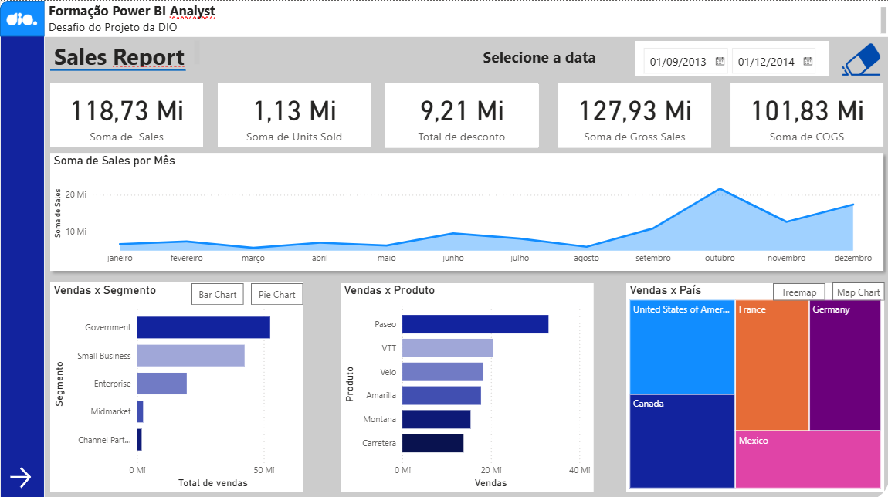
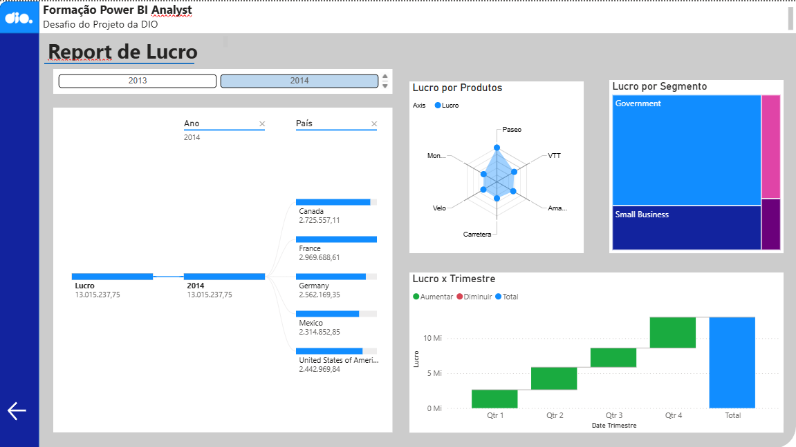

# 📊 Relatório Power BI

## 🧩 Visão Geral

Este projeto foi desenvolvido como parte do **Desafio da Formação Power BI Analyst da DIO**, com o objetivo de aplicar conhecimentos em modelagem de dados e design de dashboards interativos.

O relatório apresenta uma visão completa sobre o **desempenho de vendas e lucros** da empresa, explorando indicadores por **produto, país e segmento de clientes**.

---

## 📄 Estrutura do Relatório

O relatório está dividido em **duas páginas principais**:

### 🧾 Página 1 — Sales Report

📌 **Principais indicadores:**
- **118,73 Mi** → Soma total de *Sales*  
- **1,13 Mi** → Soma de *Units Sold*  
- **9,21 Mi** → Total de *Discounts*  
- **127,93 Mi** → Soma de *Gross Sales*  
- **101,83 Mi** → Soma de *COGS* (Custo dos Produtos Vendidos)

📊 **Visualizações:**
1. **Linha temporal de vendas por mês (2013–2014)** — mostra a sazonalidade das vendas com picos em **outubro e dezembro**.  
2. **Vendas por Segmento** — o **segmento Government** lidera em vendas, seguido por **Small Business** e **Enterprise**.  
3. **Vendas por Produto** — os produtos **Paseo** e **VTT** são os mais vendidos, enquanto **Carretera** e **Montana** têm menor volume.  
4. **Vendas por País (Treemap)** — destaque para:
   - 🇺🇸 **Estados Unidos** — maior volume de vendas  
   - 🇫🇷 **França** e 🇩🇪 **Alemanha** — mercados fortes na Europa  
   - 🇨🇦 **Canadá** — desempenho intermediário  
   - 🇲🇽 **México** — menor participação  

📈 **Insight:**  
As vendas são impulsionadas principalmente por **Paseo** e **VTT**, com **EUA** e **França** como principais mercados consumidores. A curva de crescimento mostra tendência de aumento no último trimestre, sugerindo **sazonalidade positiva**.

---

### 💰 Página 2 — Report de Lucro

📌 **Indicadores de destaque (Ano de 2014):**
- **Lucro total:** 13.015.237,75  
- **Top países por lucro:**
  - 🇫🇷 França → 2.969.688,61  
  - 🇨🇦 Canadá → 2.725.557,11  
  - 🇩🇪 Alemanha → 2.562.169,35  
  - 🇺🇸 EUA → 2.442.969,84  
  - 🇲🇽 México → 2.314.852,85  

📊 **Visualizações:**
1. **Mapa hierárquico (drill-down)** mostrando lucro total dividido por país.  
2. **Gráfico de radar — Lucro por Produto:**  
   - Produtos **Paseo** e **VTT** lideram em rentabilidade.  
3. **Treemap — Lucro por Segmento:**  
   - **Government** e **Small Business** concentram a maior parte do lucro total.  
4. **Gráfico Waterfall — Lucro por Trimestre:**  
   - Mostra **crescimento constante** ao longo do ano, com aumento significativo no **4º trimestre**.

📈 **Insight:**  
Apesar de os EUA apresentarem maior volume de vendas, **França e Canadá geram lucros mais altos**, sugerindo **melhores margens nesses mercados**.  
O **segmento governamental** é o mais lucrativo, sendo estratégico para priorização de esforços comerciais.

---

## 🗺️ Análise dos Mapas (Treemap e Drill-Down por País)

### 🗺️ Mapa 1 — *Treemap de Vendas por País* (Página 1)

O mapa destaca visualmente o **peso de cada país nas vendas totais**:

| País | Participação nas Vendas | Interpretação |
|------|--------------------------|----------------|
| 🇺🇸 EUA | Maior fatia | Mercado mais maduro e consolidado |
| 🇫🇷 França | Segunda maior | Forte rentabilidade e volume |
| 🇩🇪 Alemanha | Terceira posição | Estável, bom equilíbrio entre volume e lucro |
| 🇨🇦 Canadá | Quarta posição | Mercado relevante na América do Norte |
| 🇲🇽 México | Menor fatia | Potencial de crescimento futuro |

📊 **Conclusão:**  
A América do Norte domina em volume de vendas, enquanto a Europa equilibra **rentabilidade e estabilidade**.

---

### 🗺️ Mapa 2 — *Lucro por País (Drill-Down)* (Página 2)

O segundo mapa (hierárquico) detalha o **lucro total de cada país**.  
A **França lidera** em lucro total, superando os EUA, o que indica **eficiência operacional e melhores margens**.

📌 **Resumo de Lucro por País (2014):**

| País | Lucro (R$) | Posição |
|------|-------------|----------|
| 🇫🇷 França | 2.969.688,61 | 🥇 1º |
| 🇨🇦 Canadá | 2.725.557,11 | 🥈 2º |
| 🇩🇪 Alemanha | 2.562.169,35 | 🥉 3º |
| 🇺🇸 EUA | 2.442.969,84 | 4º |
| 🇲🇽 México | 2.314.852,85 | 5º |

💡 **Conclusão:**  
Enquanto os EUA possuem maior volume de vendas, a **França gera o maior lucro líquido**, o que pode refletir **melhores preços médios ou custos reduzidos**.

## 🖼️ Exemplos de Visualizações

  

---

## ✍️ Autor

**Jorge Ferreira**  
MBA em Data Science e Analytics — USP/ESALQ  
📍 Engenharia de Produção | Data Analytics 
---
